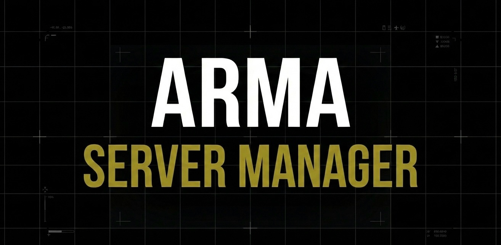

<p align="center">
  
  <h1 align="center">Arma Server Manager</h1>
  <p align="center">A modern web application for managing Arma 3 dedicated servers</p>
</p>

<p align="center">
  <a href="https://github.com/wrycu/arma_server_manager/releases"></a>
  <a href="https://github.com/wrycu/arma_server_manager/blob/main/LICENSE"></a>
</p>

<!-- TODO: Add screenshot here -->
<!-- <p align="center">
  
</p> -->

---

## Features

- **Server Management** - Create and configure multiple Arma 3 server instances
- **Mod Collections** - Organize Steam Workshop mods into reusable collections
- **Steam Workshop Integration** - Automatic mod downloading and updates
- **Server Lifecycle** - Start, stop, and monitor your servers from a single interface

## Installation

### Quick Install

**Linux / macOS:**

```bash
curl -fsSL https://raw.githubusercontent.com/wrycu/arma_server_manager/main/install.sh | bash
```

**Windows (PowerShell):**

```powershell
irm https://raw.githubusercontent.com/wrycu/arma_server_manager/main/install.ps1 | iex
```

### Manual Download

Download the latest release for your platform from the [Releases](https://github.com/wrycu/arma_server_manager/releases) page:

| Platform | Download                                 |
| -------- | ---------------------------------------- |
| Windows  | `arma_server_manager-windows-x64.zip`    |
| Linux    | `arma_server_manager-linux-x64.tar.gz`   |
| macOS    | `arma_server_manager-macos-arm64.tar.gz` |

Extract and run `arma_server_manager` to start the application.

## Usage

After installation, run:

```bash
arma_server_manager
```

The web interface will be available at `http://localhost:5000`.

For detailed usage documentation, see the [Documentation](https://notion.so/arma-server-manager) site.

## Contributing

Interested in contributing? See [CONTRIBUTING.md](./CONTRIBUTING.md) for development setup and guidelines.

## License

This project is licensed under the GNU General Public License - see the [LICENSE](./LICENSE) file for details.
